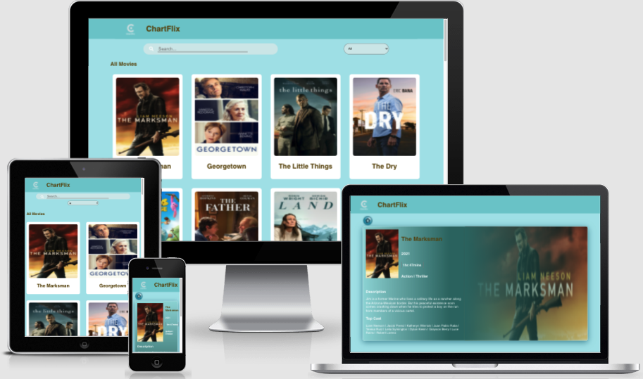
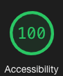
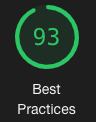
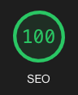
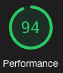

# ChartFlix

### Table of Contents

- [ChartFlix](#chartflix)
    - [Table of Contents](#table-of-contents)
  - [Overview](#overview)
    - [GitHub Repo LINK](#github-repo-link)
    - [Deployed LINK](#deployed-link)
  - [Features](#features)
  - [Technologies Used](#technologies-used)
  - [Setup Instructions](#setup-instructions)
      - [To run the app](#to-run-the-app)
      - [To run the Cypress test](#to-run-the-cypress-test)
  - [Credits](#credits)
      - [Author](#author)

## Overview

<table>
  <td>
    
  </td>
  <td>
    
  </td>
  <td>
    
  </td>
  <td>
    
  </td>
</table>

App that allows users to search/filter movies either by movie title or genre using the provided movie API by Charter/Spectrum.

### GitHub Repo [LINK](https://github.com/asiisii/chartflix)

### Deployed [LINK](https://chartflix.netlify.app/)

## Features

Fully responsive application with accessibility score of 100 (tested via lighthouse). In homepage user will be able to view 35 movie posters with their title. User is able to filter movies by genre using the select options(default option: All). user is also able to search for a movie by title. User can view more movie details by clicking on a specific movie poster.

**[Back to top](#table-of-contents)**

## Technologies Used

- Charter/Spectrum movie API
- TypeScript
- React
- TravisCI
- Cypress
- Router
- JavaScript
- HTML
- CSS
- ESLint
- Netlify
- GitHub
- Miro
- React dev tools
- Google dev tools
- Font awesome (search icon)

## Setup Instructions

1. Clone this [repository](https://github.com/asiisii/chartflix)
2. `cd` into the repository in your terminal
3. `npm i` to install required dependencies

Then:-

#### To run the app

- `npm start` in your terminal to view it on your browser
- If browser doesn't open automatically, open the browser and navigate to `http://localhost:3000`

#### To run the Cypress test

- `npm run Cypress` in your terminal to run the Cypress test (make sure the app is still running on `http://localhost:3000`)
- Then click on `_spec.js` files to run each test

## Credits

#### Author

<table>
  <tr>
    <td> Ashish Malla <a href="https://github.com/asiisii">GH</td>
  </tr>
  <td>
    
  </td>  
</table>

**[Back to top](#table-of-contents)**
